# Guide for Referees/Users

The page consists of 8 different screens which you will walk-through sequentially in general.

<table>
<tr><td>Screenshot</td><td>Description</td></tr>
<tr><td>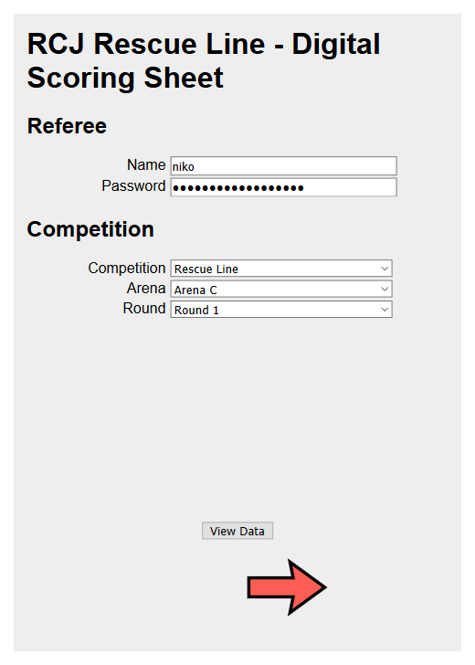</td><td>
In the upper half you can enter your credentials.
They are needed for submitting runs to a server.
Hint 1: The credentials can also be supplied in the URL (e.g. by scanning a QR-Code) so you don't need to enter them neccessarily.
Hint 2: You don't need credentials if you don't want to submit the runs, but you need to enter something before you can continue.

Below you can enter some details about the competition / the arena you are at.

You will do this setup once or at least not so often.

At the bottom you see a big navigation button to go to the next screen (S2) and the button "View Data" which leads to S8 (more details later).
</td></tr>
<tr><td>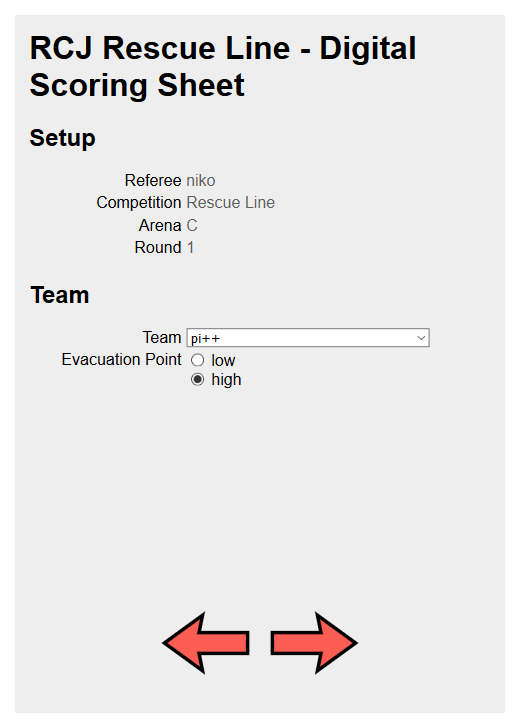</td><td>
This is the screen where you normally will start for each run.
You can see the information entered in setup above so that you can check this everytime before a run starts and go back if you notice that you need to change something.

Below you can select the team from a list.
The list depends on which competition you selected in S1 (Line / Line Entry).
The selected competition influences also whether you are able to select the evacuation point (low/high) or whether this is set automatically (for Line Entry).

After selecting the team and asking them for the evacuation point you can continue to the next screen (S3).
</td></tr>
<tr><td>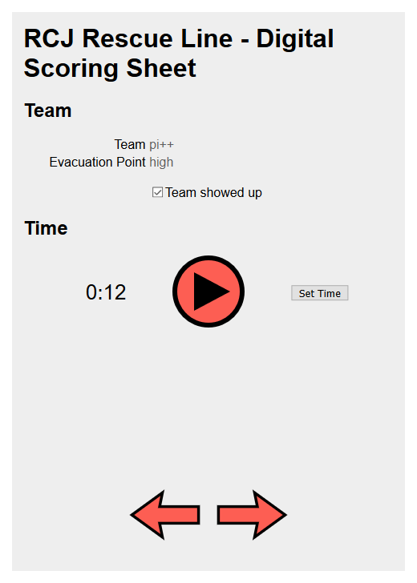  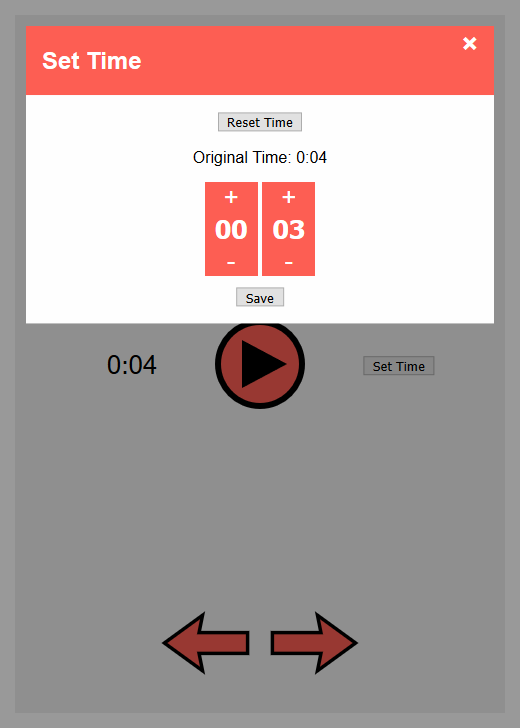</td><td>
You don't need this screen neccessarily but it is helpful when the team wants to calibrate their robot or the team is setting their checkpoints.
If the team is not there you can uncheck that the team showed up (which is checked by default).

You can set or reset the time in a time modal.
It is recommended to change the time only if it's not running.
</td></tr>
<tr><td>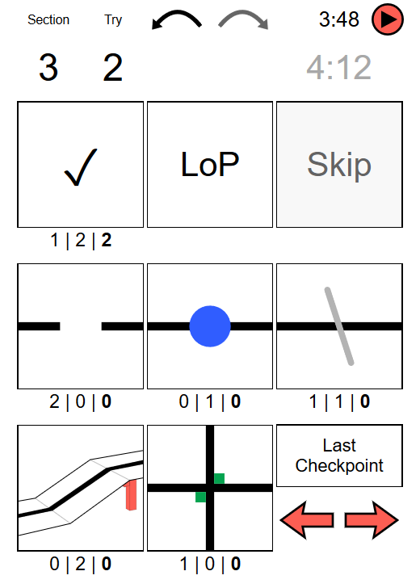  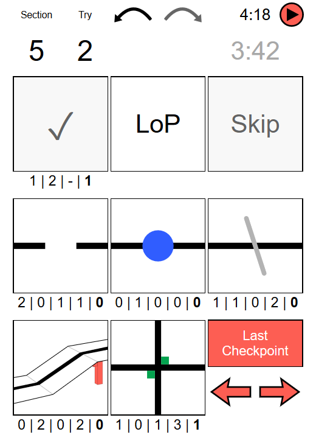</td><td>
This is the main screen which you will use during a scoring run.
It contains everything you need.

You will find the current section and the current try in the top left corner.
Right next to this is an undo and a redo button, but redo is not yet implemented.
The top right corner contains everything for stopping the time.
If you want to change it you can go back to S3, but keep in mind that the navigation buttons can only be used when the time is not running.
This should prevent you from accidentally navigating to another screen during a scoring run.
You can also change the time in review (S6).

In the first row of buttons below you find the buttons needed for sections: section complete, Lack of Progress, skipped section.
Below the first button you will see the number of tries for each section.
If you need to undo a step please use the undo button.

Below there are buttons for scoring elements (gap, obstacle, speed bump, ramp, intersection).
Similar to the sections you will find the number of scoring elements per section directly under each button.
A normal click will increase the count of the correspondig scoring element in the current section and a long touch / right click will decrease it.
You can also use the undo button.

In the bottom right corner you will find a button to mark the last checkpoint.
After the last checkpoint scoring elements and LoPs still count.
You can undo this by using the undo button or by clicking it again (it acts as a toggle button).
**Important**: You still need to mark the section as complete with the top left button before.
You will see that the number of tries for the current section will vanish once you click the "last checkpoint" button (because a team can't score points for tiles/sections).
You can derive the number of LoPs after the last checkpoint from the number of tries in the top left corner (just subtract 1).

**Important**: You can change most values in review so don't be afraid when you make a mistake.
But it is **not** possible to add or remove sections in review.

After stopping the time when the scoring run ends you can continue to S5.
</td></tr>
<tr><td>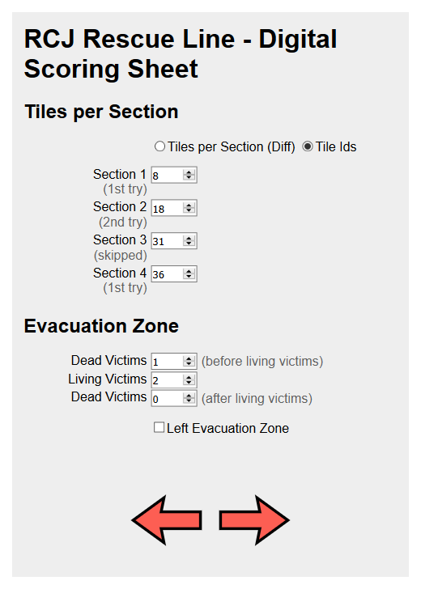</td><td>
Here you can enter the number of tiles per section in the top half.
You can choose between entering the tiles per section or entering the tile ids of checkpoints.
Tiles ids are default since we will have a map with tile ids for each arena in Berlin competition.
This makes it easier to calculate the number of tiles between checkpoints but it also gives you the oppurtunity to enter the tile ids directly and let the computer do this hard math.

The bottom part lets you enter the number of rescued victims if the team made it beyond the last checkpoint.
For Line you must distinguish between living and dead victims and even when they were rescued.
</td></tr>
<tr><td>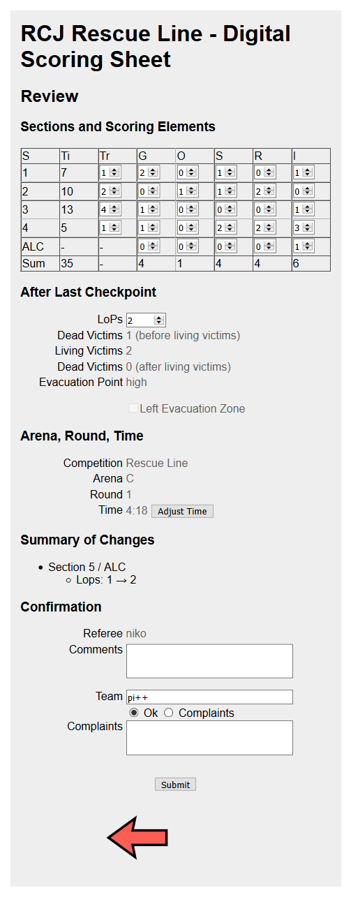</td><td>
S6 lets you review the scoring sheet together with the team captain.

In the top there is a table with nearly all information of the run including the number of tiles, needed tries and scoring elements for each section.
To keep this table small, abbreviations are used.
But you can just hover over an element or click on it to see a tooltip with the correct name.

Directly under the table you are able to see and change the number of LoPs after the last checkpoint.
You can also see the rescued victims.
If you want to change these please go right back one step to S5.

Below you see some general information including the time which you can change there in a modal like in S3.

Before you and the team captain can confirm everything you will see a list of all changes made during review.
This should help you to not change anything accidentally.
Don't be confused when you see that the time was changed - this will happen automatically if you stopped the time after 8 minutes.

The team captain can check the Ok button if everything is fine for him, otherwise he can enter his complaints (or you enter his words).

If there is anything you want to change which is not possible in the review screen (e.g. competition, evacuation point, arena, round, your credentials, ...) please enter this in the comment box (except credentials) and submit the run like this.
We will then fix this manually.
When your credentials are wrong you can change them afterwards and resubmit the run in S8.
</td></tr>
<tr><td>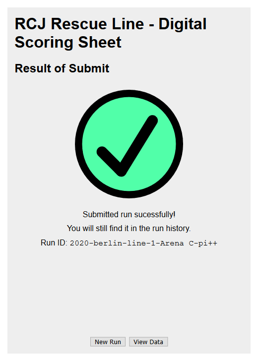  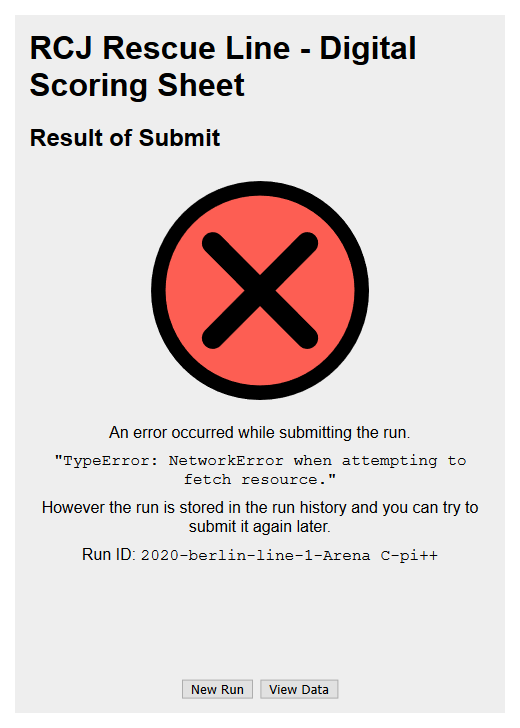</td><td>
This screen shows you the result of submit together with the run id by which you will find it in the run history (S8).
Possible errors which can occur are bugs in our code, a missing internet connection, you submitted a run which already exists, ...
The displayed message could possibly help you and tell you why the error happened.
(A NetworkError can occur because you don't have an internet connection but also because of a misconfigured backend server).

When everything worked as expected you can directly create a new run (this button leads you to S2).
Otherwise you can also check the run history (S8).
</td></tr>
<tr><td>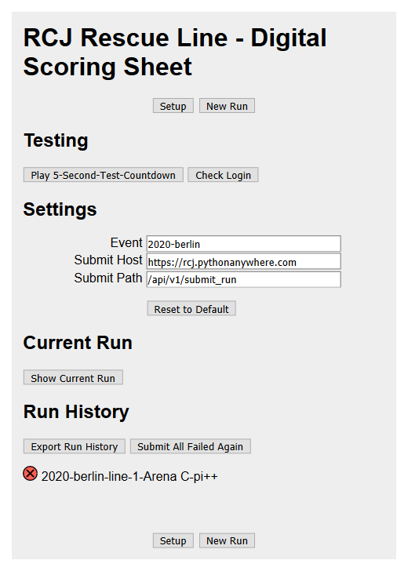</td><td>
This last screen is mainly about viewing data like the history of all runs you tried to submit, but it also contains some stuff which fitted nowhere else.

You will see some stuff for testing and debugging there.
Even some settings which you normally don't need to change are located here.
The "Check Login" button could be helpful for you when you are wondering whether your credentials are valid or not.

At the bottom you will find the run history with the status of each run displayed as an icon.
You can export all runs as a JSON file or you can resubmit all failed runs again.
When resubmitting a run your credentials from S1 are used so they might have been changed since the last submit (especially helpful when you entered wrong credentials when trying to submit run the first time).
</td></tr>
</table>

Everything gets stored in Cache/LocalStorage so that no data will be lost unless you clear the storage.
Even your current page is saved (so you will see the same screen after reloading).
Please don't use system navigation buttons (like "Back") but instead navigation buttons offered to you on the screens.

This project is a Progressive Web App (PWA) which allows you to add this to your home screen like a normal app.
You can still use it like a normal website if you want.

Further features are planned and feedback is highly appreciated.
Don't matter whether you experience a bug, find something which you think might be not intuitive, have an idea, ... just contact us.

If you are interested in technical details you can also check out the [README](../README.md) in the main directory of this project.
